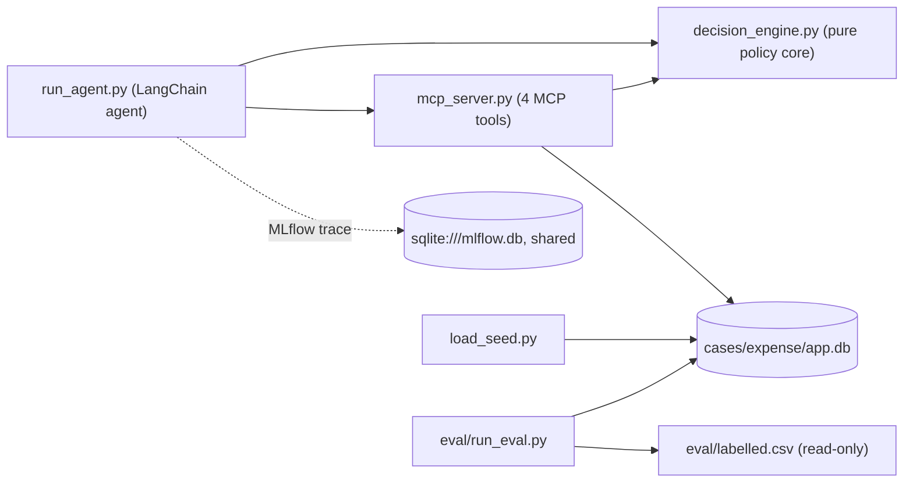

# Architecture Spine — Expense Claim Reviewer

## Design Paradigm

**Deterministic Policy Core with an LLM Narrator.** The domain core (`decision_engine.py`) is pure, LLM-free code implementing `POLICY.md`'s precedence order, per-window aggregation, and duplicate detection — fully unit-testable against `eval/labelled.csv` with no model in the loop. MCP tools are thin adapters over SQLite. The LangChain agent is the driving adapter: it calls tools and the domain core to get an exact `(decision, clause)`, and asks the LLM only to narrate the explanation. The LLM never picks a decision or a clause.

## Invariants & Rules



`decision_engine.py` has no dependency on `mcp_server.py`, `run_agent.py`, SQLite, or the LLM — it is a dependency-free leaf module.

### AD-1 — Decision-making is deterministic, not LLM-authored `[ASSUMPTION]`

- **Binds:** CAP-2, CAP-3, CAP-4, FR-2, FR-3
- **Prevents:** the LLM picking a different decision or clause on different runs, which would fail the 100%-exact-match success metric.
- **Rule:** `decision_engine.decide_line_item(line_item, employee, limits, claim_line_items) -> (decision, clause)` implements `POLICY.md`'s precedence order in plain code. The agent passes this exact output to `record_decision`. The LLM is never asked to choose the decision or the clause. The logic must be a general implementation of `POLICY.md` with no branching on specific `claim_id`/`line_id`/`employee_id` values — no lookup tables keyed to the labelled set. Generalizing correctly to the unscored 10-claim holdout, not just the 30 labelled claims, is the actual success bar (PRD counter-metric SM-C1).
- *Confirmed with the user 2026-09-27: tightens a prior SPEC.md assumption that the LLM made the line-by-line call using precomputed facts.*

### AD-2 — `decisions` schema matches BRIEF.md exactly; explanations live in the trace `[ADOPTED]`

- **Binds:** CAP-5, CAP-7, FR-4, FR-6
- **Prevents:** a builder adding an undocumented explanation column to `decisions`, or disagreement over where the judge reads explanations from.
- **Rule:** `decisions` has exactly the columns BRIEF.md's `record_decision(line_id, decision, clause)` implies. The natural-language explanation is never persisted to SQLite — it is the agent's response content, captured by MLflow tracing. This fixes what this build writes; whether it satisfies the existing 3:00 dashboard's read expectations is a separate, still-open integration question (see Deferred), not settled by this AD.

### AD-3 — `record_decision` is an upsert keyed on `line_id` `[ADOPTED]`

- **Binds:** CAP-5, FR-4
- **Prevents:** duplicate or appended rows when the agent re-runs on a claim it already processed.
- **Rule:** `record_decision` executes `INSERT ... ON CONFLICT(line_id) DO UPDATE`; `line_id` is the `decisions` table's primary key.

### AD-4 — Duplicate detection and aggregation are single-claim scoped `[ADOPTED]`

- **Binds:** CAP-4, FR-3
- **Prevents:** a builder adding a cross-claim query or a fifth tool that BRIEF.md's contract doesn't include; a future reader mistaking this AD for a restatement of POLICY.md 5.1 itself.
- **Rule:** `POLICY.md` 5.1 scopes duplicates to the *same employee*, not the same claim — this implementation narrows detection to same-employee-*and*-same-claim (only the line items one `get_claim` call returns) as an accepted, data-justified approximation, not a reinterpretation of the policy: a scan of all 159 line items across all 40 claims found zero cross-claim duplicates. Per-day aggregation (2.1, 6.1) is likewise computed only from one claim's line items. `line_id` is a given seed-data field — `load_seed.py` does not assign it — and its ascending order was empirically verified against all 3 observed duplicate pairs' labels before being adopted as the same-date tiebreak (lower kept, higher rejected).

### AD-5 — Exactly four MCP tools `[ADOPTED]`

- **Binds:** all
- **Prevents:** `decision_engine.py` being registered as a fifth MCP tool, silently expanding BRIEF.md's fixed tool contract.
- **Rule:** the MCP server exposes only `get_claim`, `get_employee`, `get_policy_limits`, `record_decision`. `decision_engine.py` is a plain importable module, called internally, never a registered tool.

### AD-6 — Own database file, no cross-imports with Saturday's code `[ADOPTED]`

- **Binds:** all
- **Prevents:** schema collisions with Saturday's `tickets`/`customers` tables, or this case's load script touching the root `app.db`.
- **Rule:** this case's SQLite file is `cases/expense/app.db`, loaded only by `cases/expense/load_seed.py`. Nothing under `cases/expense/` imports from or writes to root `mcp/`, root `run_agent.py`, or root `app.db`.

### AD-7 — MLflow traces to the shared store, tagged by case `[ADOPTED]`

- **Binds:** all
- **Prevents:** a second, per-case MLflow database that breaks the single `mlflow ui --backend-store-uri sqlite:///mlflow.db` command.
- **Rule:** `run_agent.py` traces to the shared `sqlite:///mlflow.db`, under an experiment name/tag (e.g. `expense-claim-reviewer`) that distinguishes it from Saturday's triage traces in the same store.

### AD-8 — Currency arithmetic uses `Decimal`, never `float` `[ASSUMPTION]`

- **Binds:** CAP-3, FR-2
- **Prevents:** floating-point rounding silently flipping a line item across the 20%-over threshold (POLICY.md 2.4), failing the exact-match success metric on a boundary case.
- **Rule:** amounts are parsed as `decimal.Decimal` at the SQLite boundary. All sums and percentage comparisons use `Decimal`. Rounding happens only when formatting the explanation text. JSON (the MCP wire format) has no `Decimal` type: amount and limit fields cross the MCP JSON-RPC boundary as strings, and both the server and any client parse them to `Decimal` immediately on receipt — never as native `float`.

### AD-9 — The $500+ approval gate is derived, never stored `[ASSUMPTION]`

- **Binds:** CAP-6, FR-5
- **Prevents:** a builder adding a fourth decision value or an `approved_by` column this MVP has no way to populate, since payout execution is out of scope.
- **Rule:** any `decisions` row with `decision = 'approve'` on a line item over $500 is, by definition, pending human sign-off. No column or decision value represents this state directly; the (out-of-scope) dashboard computes the pending set by filtering on this condition.

### AD-10 — Reimbursable total is a derived query, computed once `[ASSUMPTION]`

- **Binds:** CAP-8
- **Prevents:** two consumers (the eval script, any future dashboard) computing "reimbursable total" with different logic or precision — e.g. one excluding pending-approval items, one using `float`.
- **Rule:** reimbursable total per claim is `SUM(amount)` in `Decimal`, over `line_items JOIN decisions` where `decision = 'approve'`, grouped by `claim_id` — including items still pending the $500 gate (AD-9), matching PRD §3's Glossary definition. This is a read-only query, not a stored column or a dedicated module; `eval/run_eval.py` and any future dashboard compute it identically.

### AD-11 — `get_policy_limits` returns a category-keyed dict `[ADOPTED]`

- **Binds:** CAP-1, FR-1
- **Prevents:** the MCP-server implementer returning a list of rows while the decision-engine implementer expects a dict (or vice versa) — a call-boundary break that compiles on both sides and fails silently at runtime.
- **Rule:** `get_policy_limits(level, city)` returns `{category: Decimal(limit_cad)}` covering all four categories present in `limits.csv` for that `(level, city)` pair. `decision_engine.py` indexes by the category name exactly as it appears in `limits.csv`. (Resolves `SPEC.md`'s open question on this tool's return shape.)

### AD-12 — Full runs start from a truncated `decisions` table `[ASSUMPTION]`

- **Binds:** CAP-5, CAP-8, FR-4
- **Prevents:** the eval script silently scoring a mix of decisions from different runs (e.g. 39 claims from an old `decision_engine.py` version, 1 re-run after a fix) with no way to detect the mix.
- **Rule:** the run harness (`run_agent.py` or a driver script) truncates `decisions` before starting a full run over all 40 claims. A partial or single-claim debug run is not eval-safe and must be followed by a full re-run before scoring against `eval/labelled.csv`.

## Consistency Conventions

| Concern | Convention |
| --- | --- |
| Naming (entities, files, interfaces, events) | IDs (`claim_id`, `line_id`, `employee_id`) are opaque strings, passed through verbatim — never parsed or reformatted. |
| Data & formats (ids, dates, error shapes, envelopes) | Currency amounts are `Decimal` (AD-8). Dates are ISO `YYYY-MM-DD`, matching the seed CSVs. |
| State & cross-cutting (mutation, errors, logging, config, auth) | `load_seed.py` is idempotent — running it twice yields the same `app.db` (matches Saturday's `load_seed.py` convention). Model/provider config comes from the root `.env` (`MODEL`, `GEMINI_API_KEY`, `PROVIDER`, `JUDGE_MODEL`, `GROQ_API_KEY`) per root `AGENTS.md` — not re-declared per case. |

## Stack

| Name | Version |
| --- | --- |
| Python | >=3.12 |
| langchain | >=1.0 |
| langchain-google-genai | >=2.1 |
| langchain-groq | >=0.3 |
| langchain-mcp-adapters | >=0.1 |
| mcp | >=1.9 |
| mlflow | >=3.4 |
| pydantic | >=2.8 |
| python-dotenv | >=1.0 |

Reused as-is from the repo's `pyproject.toml`/`uv.lock` (brownfield — no new dependency introduced for this case).

## Structural Seed

```text
cases/expense/
  app.db               # this case's SQLite db (gitignored) - AD-6
  load_seed.py          # loads seed/*.csv into app.db, idempotent
  decision_engine.py    # pure functions: precedence order, aggregation, duplicate detection - AD-1
  mcp_server.py         # exposes the 4 MCP tools - AD-5
  run_agent.py           # LangChain agent: orchestrates tools + decision_engine, LLM narrates - AD-1, AD-7
  eval/
    run_eval.py          # scores decisions against labelled.csv
    labelled.csv          # read-only, given
  seed/                  # read-only, given
  BRIEF.md, POLICY.md    # read-only, given
  AGENTS.md              # already written
  INTENT.md              # to be written before implementation, per root AGENTS.md
```

## Capability → Architecture Map

| Capability | Lives in | Governed by |
| --- | --- | --- |
| CAP-1 (assemble claim context) | `mcp_server.py` (`get_claim`, `get_employee`, `get_policy_limits`) | AD-5, AD-6 |
| CAP-2 (decide precedence order) | `decision_engine.py` | AD-1, AD-8 |
| CAP-3 (per-window aggregation) | `decision_engine.py` | AD-1, AD-8 |
| CAP-4 (duplicate detection) | `decision_engine.py` | AD-1, AD-4 |
| CAP-5 (record idempotently) | `mcp_server.py` (`record_decision`) | AD-2, AD-3 |
| CAP-6 ($500 approval gate) | `decisions` table, read as a derived view | AD-9 |
| CAP-7 (explain each decision) | `run_agent.py` (LLM call) + MLflow trace | AD-1, AD-2, AD-7 |
| CAP-8 (eval scoring) | `eval/run_eval.py` | AD-10, AD-12; reads `decisions` + `eval/labelled.csv` |

## Deferred

- Whether the `decisions` schema (AD-2) matches what the existing 3:00 dashboard expects to read — not resolvable from this spine; needs an answer from whoever owns the dashboard before the demo (open question, carried from `SPEC.md`/PRD).
- **LLM-judge scoring of explanation quality** (BRIEF.md's second check — "is each explanation clear, and does it cite the right clause?") is not wired into this architecture for MVP, consistent with the PRD dropping SM-3. If judge scoring turns out to matter for the live demo grading, it reuses Saturday's judge pattern (`JUDGE_MODEL` via Groq) reading the explanation from the MLflow trace (AD-2) — not yet built.
- Exact LangChain agent prompt and tool-calling loop wiring — implementation detail, code owns it.
- `load_seed.py`'s specific idempotency mechanism (upsert vs. drop-and-recreate) — single-owner script, low fork-risk.

**Flagged, out of this spine's scope:** root `pyproject.toml` pins `mcp>=1.9` (unbounded — the MCP Python SDK shipped a breaking 2.0.0 on 2026-07-28) and `langchain-mcp-adapters>=0.1` (deprecated upstream since LangChain 1.4.0 folded MCP support into core `langchain.mcp`, but root pins `langchain>=1.0`, not `>=1.4`). This is a shared dependency file affecting Saturday's already-built code too — not changed here per `AGENTS.md`'s story-scope rule, but worth a deliberate decision before this case is built against it.
